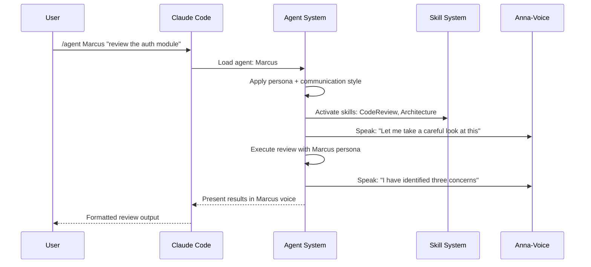

# Agent Architecture

Agents are persistent AI personas with distinct identities, communication styles, and voice assignments. Unlike skills (which are stateless instruction sets), agents maintain identity and behavioral patterns throughout their engagement.

---

## Agent File Structure

Each agent is defined by a file in the `agents/` directory:

```
agents/
  marcus.md
  kira.md
  dev.md
  quinn.md
  sage.md
  sentry.md
  doc.md
  tester.md
  data.md
  scout.md
  voice.md
  coach.md
  planner.md
  debugger.md
  designer.md
  ops.md
```

### Agent Definition Format

```markdown
---
name: Marcus
title: Engineering Leadership
voice_id: marcus_webb
voice_settings:
  stability: 0.62
  similarity_boost: 0.80
  speed: 0.98
personality: Battle-scarred tech lead, strategic thinker
skills: [CodeReview, Architecture, Refactor, TDD]
---

# Marcus - The Battle-Scarred Leader

## Backstory
Worked his way up from junior engineer through
technical leadership over 15 years...

## Communication Style
"Let me think about this long-term..."
"I have seen this pattern before - it does not scale"
Deliberate delivery, strategic questions, measured wisdom

## Expertise
- Architectural decision-making
- Technical trade-off analysis
- Code review and mentoring
- Long-term system design
```

### Agent Frontmatter Fields

| Field | Type | Description |
|-------|------|-------------|
| `name` | string | Agent display name |
| `title` | string | Agent specialty title |
| `voice_id` | string | Anna-Voice persona ID |
| `voice_settings` | object | TTS parameters (stability, speed, etc.) |
| `personality` | string | Brief personality description |
| `skills` | string[] | Skills this agent can invoke |

---

## Agent vs. Skill Comparison

| Aspect | Skill | Agent |
|--------|-------|-------|
| **Definition** | SKILL.md with instructions | Agent .md with persona |
| **Identity** | None | Name, voice, personality |
| **State** | Stateless per invocation | Maintains identity in session |
| **Voice** | No voice output | Dedicated voice persona |
| **Scope** | Single capability | Multiple skills combined |
| **Trigger** | Keyword match | `/agent <name>` command |
| **Memory** | No memory | Session-scoped memory |
| **Communication** | Standard output | Character-specific style |
| **Chaining** | Can chain other skills | Can invoke skills and other agents |

---

## All 16 Agents

| # | Agent | Title | Primary Skills | Voice |
|---|-------|-------|---------------|-------|
| 1 | Marcus | Engineering Leadership | CodeReview, Architecture | Deep, measured |
| 2 | Kira | Frontend Development | UIDesign, Accessibility, CSS | Warm, energetic |
| 3 | Dev | Backend Engineering | APIDesign, Database, TDD | Calm, precise |
| 4 | Quinn | DevOps/Infrastructure | K8sDeploy, Docker, CICD | Direct, efficient |
| 5 | Sage | Architecture | SystemDesign, TradeOffs | Thoughtful, slow |
| 6 | Sentry | Security | SecurityAudit, PenTest | Alert, sharp |
| 7 | Doc | Documentation | APIDoc, TechWriting | Clear, patient |
| 8 | Tester | Quality Assurance | TDD, TestStrategy | Methodical, thorough |
| 9 | Data | Database Engineering | DBMigration, QueryOptimize | Analytical, precise |
| 10 | Scout | Reconnaissance | Recon, OSINT | Quiet, focused |
| 11 | Voice | Voice Integration | VoiceIntegration, TTS | Adaptive, clear |
| 12 | Coach | Code Review | CodeReview, BestPractices | Supportive, direct |
| 13 | Planner | Project Planning | WavePlanner, SpecDriven | Organized, structured |
| 14 | Debugger | Troubleshooting | Debugging, RootCause | Patient, systematic |
| 15 | Designer | UX/UI Design | UIDesign, UserResearch | Creative, empathetic |
| 16 | Ops | Production Operations | Monitoring, IncidentResponse | Calm under pressure |

---

## Agent Lifecycle



### Lifecycle Phases

1. **Loading** --- Agent definition is parsed, persona is applied
2. **Greeting** --- Agent introduces itself (spoken via voice)
3. **Context Gathering** --- Relevant project context and memory are loaded
4. **Skill Activation** --- Agent's associated skills are activated
5. **Execution** --- Work is performed with the agent's characteristic style
6. **Reporting** --- Results are presented in the agent's voice and format
7. **Dismissal** --- Agent is deactivated (memory persists in session)

---

## Agent Handoffs

Agents can hand off work to other agents when a task crosses domain boundaries:

```
Marcus (review) --> Finds security issue --> Sentry (security audit)
Sentry (audit) --> Finds DB vulnerability --> Data (database fix)
Data (fix) --> Creates migration --> Tester (verify tests pass)
```

Handoffs preserve context and the receiving agent is briefed on prior findings.

---

## Creating Custom Agents

See the [Custom Components](/superpai/implementation/custom-components) guide for the complete agent creation template and registration process.
