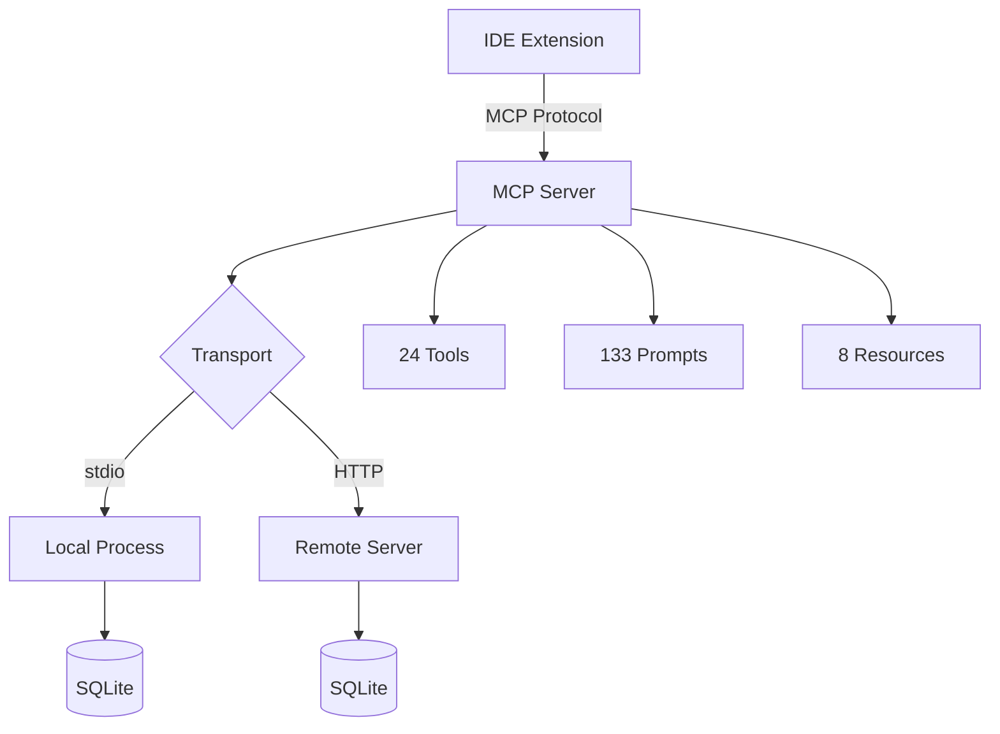

# MCP Architecture

SuperPAI+ integrates with IDEs through the Model Context Protocol (MCP). The MCP layer exposes 24 tools, 133 prompts, and 8 resources that allow IDE extensions to access SuperPAI+ capabilities without running the full plugin.

---

## 24 MCP Tools

| # | Tool | Category | Description |
|---|------|----------|-------------|
| 1 | `superpai_health` | System | Check system health status |
| 2 | `superpai_version` | System | Get version information |
| 3 | `superpai_status` | System | Get session status |
| 4 | `superpai_config` | System | Read/write configuration |
| 5 | `superpai_command` | Commands | Execute a slash command |
| 6 | `superpai_skill` | Skills | Invoke a specific skill |
| 7 | `superpai_agent` | Agents | Invoke a specific agent |
| 8 | `superpai_memory_read` | Memory | Read memory entries |
| 9 | `superpai_memory_write` | Memory | Write a memory entry |
| 10 | `superpai_memory_search` | Memory | Search memory entries |
| 11 | `superpai_cost` | Cost | Get cost tracking data |
| 12 | `superpai_session_status` | Session | Get all session statuses |
| 13 | `superpai_inbox_read` | Session | Read inbox messages |
| 14 | `superpai_inbox_send` | Session | Send an inbox message |
| 15 | `superpai_audit` | Security | Run security audit |
| 16 | `superpai_test` | Development | Run tests |
| 17 | `superpai_review` | Development | Run code review |
| 18 | `superpai_quick` | GSD | Execute a /quick task |
| 19 | `superpai_spec` | GSD | Generate a specification |
| 20 | `anna_speak` | Voice | Send TTS message |
| 21 | `anna_listen` | Voice | Activate STT |
| 22 | `anna_dispatch` | Voice | Route message to agent voice |
| 23 | `superpai_db_query` | Database | Execute a database query |
| 24 | `superpai_sync` | Sync | Synchronize session state |

---

## 133 MCP Prompts

Prompts are pre-built templates for common workflows. They are organized into categories:

| Category | Count | Examples |
|----------|-------|---------|
| Development | 28 | "Write tests for...", "Refactor...", "Debug..." |
| Architecture | 15 | "Design a system for...", "Evaluate trade-offs..." |
| Security | 18 | "Audit authentication...", "Check for XSS..." |
| DevOps | 14 | "Create Dockerfile...", "Write K8s manifest..." |
| Database | 12 | "Optimize query...", "Design schema for..." |
| Documentation | 10 | "Generate API docs...", "Write README..." |
| Review | 8 | "Review pull request...", "Check code quality..." |
| Planning | 10 | "Break down feature...", "Estimate timeline..." |
| Voice | 6 | "Configure agent voice...", "Test TTS..." |
| Memory | 5 | "Capture learning...", "Search knowledge..." |
| Testing | 7 | "Generate test cases...", "Coverage analysis..." |

Prompts are stored as templates in the MCP server and can be customized.

---

## 8 MCP Resources

| # | Resource | URI | Description |
|---|----------|-----|-------------|
| 1 | Skills Index | `superpai://skills` | Complete skill catalog |
| 2 | Commands Index | `superpai://commands` | All 47 commands |
| 3 | Agents Index | `superpai://agents` | All 16 agents |
| 4 | Session Status | `superpai://session` | Current session info |
| 5 | Memory | `superpai://memory` | Persistent memory entries |
| 6 | Cost Report | `superpai://cost` | Current cost data |
| 7 | Health | `superpai://health` | System health status |
| 8 | Configuration | `superpai://config` | Current settings |

Resources provide read-only access to SuperPAI+ state and can be referenced by IDEs for context augmentation.

---

## Transport Modes

### stdio Transport

The default transport for local development. The MCP server runs as a child process of the IDE:

```json
{
  "mcpServers": {
    "superpai": {
      "command": "bun",
      "args": ["run", "/home/user/.claude/SuperPAI/superpai-server/mcp.ts"],
      "env": {
        "SUPERPAI_DB_PATH": "/home/user/.claude/SuperPAI/superpai-server/data/superpai.db"
      }
    }
  }
}
```

### HTTP Streamable Transport

For remote deployments and team sharing. The MCP server runs as an HTTP service:

```json
{
  "mcpServers": {
    "superpai": {
      "url": "https://superpai.anshintech.net/mcp",
      "headers": {
        "Authorization": "Bearer <api-key>"
      }
    }
  }
}
```

### Transport Comparison

| Aspect | stdio | HTTP Streamable |
|--------|-------|-----------------|
| Setup | Zero config | Requires server deployment |
| Latency | Minimal (local) | Network-dependent |
| Team sharing | Not possible | Multiple users on one server |
| Security | Process-level isolation | HTTPS + API key auth |
| Persistence | Per-user database | Shared database |

---

## MCP Server Architecture



The MCP server is built with Bun and uses the same SQLite database as the main superpai-server. In remote deployments, it runs behind an Nginx reverse proxy with HTTPS.

---

## Adding Custom MCP Tools

Custom MCP tools can be registered by creating tool definitions in the `mcp/tools/` directory. See the [Custom Components](/docs/implementation/custom-components) guide for details.
