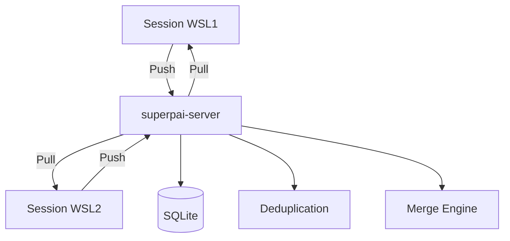

# Memory Architecture

The memory system provides persistent context across sessions, projects, and the entire SuperPAI+ platform. It uses a tiered architecture with automatic classification, confidence scoring, and sync capabilities.

---

## Memory Tiers

### Tier 1: Session Memory

- **Scope:** Current Claude Code session only
- **Storage:** In-memory (no persistence)
- **Lifetime:** Until session ends
- **Auto-captured:** Files read, decisions made, errors encountered, test results
- **Size limit:** Managed by context window

Session memory is the working memory of the current interaction. It includes everything the AI has seen and done in this session.

### Tier 2: Project Memory

- **Scope:** Current project (identified by git root or directory path)
- **Storage:** SQLite in superpai-server
- **Lifetime:** Permanent (until explicitly deleted)
- **Auto-captured:** Architecture decisions, coding conventions, dependency notes
- **Size limit:** 10,000 entries per project

Project memory captures patterns and decisions specific to a codebase. When you start a new session in the same project, relevant project memories are loaded automatically.

### Tier 3: Global Memory

- **Scope:** All projects and sessions
- **Storage:** SQLite in superpai-server
- **Lifetime:** Permanent (until explicitly deleted)
- **Auto-captured:** User preferences, tool configurations, cross-project patterns
- **Size limit:** 5,000 entries

Global memory captures knowledge that applies everywhere, like your preferred coding style, common tool configurations, and general engineering patterns.

---

## Memory Entry Structure

```json
{
  "id": "mem_abc123",
  "tier": "project",
  "category": "convention",
  "content": "This project uses barrel exports in every directory",
  "source": {
    "session": "WSL1",
    "file": "src/index.ts",
    "task": "Code review of auth module"
  },
  "confidence": 0.85,
  "observations": 3,
  "created_at": "2026-03-01T10:00:00Z",
  "updated_at": "2026-03-09T14:30:00Z",
  "tags": ["typescript", "imports", "structure"]
}
```

### Memory Categories

| Category | Description | Auto-classified By |
|----------|-------------|-------------------|
| `pattern` | Recurring code patterns | Repeated observations |
| `convention` | Team/project conventions | File structure analysis |
| `gotcha` | Common pitfalls and warnings | Error recovery events |
| `preference` | User preferences | Explicit `/learn` commands |
| `decision` | Architectural decisions | `/spec` workflow ADRs |
| `tool` | Tool configurations | Setup and config actions |

---

## Learning Pipeline

### Input: /learn Command

```bash
/learn "Database migrations must be backward-compatible for zero-downtime deploys"
```

Creates a memory entry with:
- `tier`: project (default) or global (if specified)
- `category`: auto-classified based on content
- `confidence`: 0.50 (initial)
- `observations`: 1

### Confidence Growth

Confidence increases when the same pattern is observed multiple times:

| Observations | Confidence | Status |
|-------------|------------|--------|
| 1 | 0.50 | Pending |
| 2 | 0.65 | Pending |
| 3 | 0.75 | Ready for evolution |
| 5+ | 0.90 | High confidence |
| 10+ | 0.95 | Established pattern |

### Output: /evolve Command

```bash
/evolve review      # Review high-confidence learnings
/evolve              # Apply approved learnings to behavior
/evolve rollback     # Undo the last evolution
```

The `/evolve` command takes learnings with confidence >= 0.75 and incorporates them into the AI's behavioral patterns. This is always user-controlled and never automatic.

---

## Spec Files (v3.7.0)

Spec files provide structured, persistent context for feature development:

| File | Created By | Content |
|------|-----------|---------|
| `.planning/spec-<feature>.md` | `/spec` command | Requirements, constraints, acceptance criteria |
| `.planning/waves-<feature>.md` | `/spec` command | Wave breakdown, task list, status tracking |
| `.planning/decisions-<feature>.md` | Implementation | Architectural Decision Records (ADRs) |

### Spec File Loading

When a session starts in a directory containing `.planning/`, spec files are automatically loaded into session memory. This enables multi-session and multi-day feature development with full context preservation.

---

## Sync Architecture



### Sync Process

1. **Push:** Session sends new memory entries to the server
2. **Deduplicate:** Server checks for duplicate content
3. **Merge:** Similar entries are merged (confidence combined)
4. **Pull:** Other sessions receive updates on next sync

### Sync Timing

- **Startup:** Full sync of project and global memory
- **Periodic:** Every 60 seconds during active sessions
- **On-demand:** `/sync` command triggers immediate sync
- **Shutdown:** Final push of session learnings

Sync latency in v3.7.0 is under 1 second (improved from 5 seconds in v3.6.x through batched writes and delta sync).

---

## Maintenance

```bash
/memory stats          # Show memory tier sizes and health
/memory compact        # Remove low-confidence, old entries
/memory export json    # Export all memory to JSON
/memory import file    # Import memory from JSON backup
/forget id:mem_abc123  # Delete a specific entry
```
