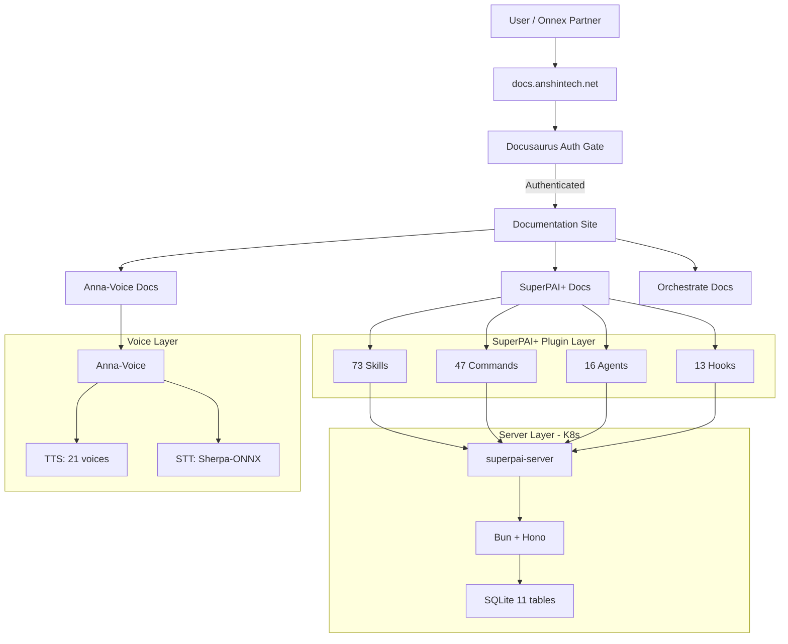
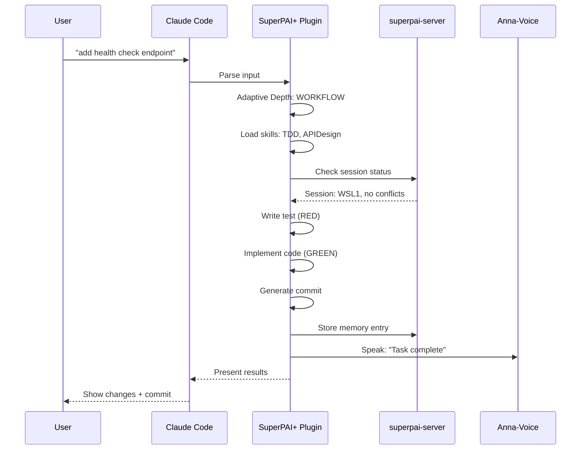

# Architecture Overview

SuperPAI+ is built as a layered, modular system where each layer has clear responsibilities and well-defined interfaces. This document provides a high-level view of the architecture, component relationships, and design principles.

---

## 7-Layer Architecture

| Layer | Name | Technology | Responsibility |
|-------|------|------------|----------------|
| 1 | **Steering** | Markdown rules | Constitutional governance (42 rules) |
| 2 | **Identity** | Agent definitions | Persona, voice, and behavior management |
| 3 | **Skills** | SKILL.md files | Specialized capability modules (73 skills) |
| 4 | **Commands** | Slash command registry | User-facing command interface (47 commands) |
| 5 | **Hooks** | hooks.json + bash scripts | Lifecycle event automation (13 hooks) |
| 6 | **Server** | Bun + Hono + SQLite | Persistent storage and REST API |
| 7 | **MCP** | MCP protocol | IDE integration layer (tools, prompts, resources) |

---

## 4-Layer Deployment Stack

| Stack Layer | Component | Deployment |
|-------------|-----------|------------|
| **Client** | Claude Code CLI + Plugin | Local workstation |
| **Voice** | Anna-Voice native app | Windows (local or remote) |
| **Server** | superpai-server (Bun + Hono) | Local, remote, or K8s |
| **IDE** | MCP integration | IDE-specific configuration |

---

## Component Diagram

---

## Design Principles

### 1. Modularity Over Monolith

Every component is independently deployable and replaceable. Skills, commands, hooks, and agents are loaded from the filesystem --- no compilation required. Adding a new skill is as simple as creating a `SKILL.md` file.

### 2. Convention Over Configuration

SuperPAI+ uses sensible defaults everywhere. The installer sets up a working system with zero configuration. Advanced users can customize through configuration files, but the defaults work for most use cases.

### 3. Additive Architecture

New features are added without breaking existing ones. The v3.7.0 GSD framework is a perfect example --- it adds `/quick`, `/spec`, and model aliases without modifying any existing commands or skills.

### 4. Fire-and-Forget Communication

Voice notifications, session updates, and memory writes all use fire-and-forget patterns. If a component is unavailable, operations continue without blocking.

### 5. Constitutional Governance

The 42 steering rules are immutable during runtime. They define behavior boundaries that cannot be overridden by user commands, skills, or agents. This ensures safety and consistency.

### 6. Test-First Everything

TDD is not just a skill --- it is enforced at the architectural level. The hook system ensures tests are written before implementation in WORKFLOW and ALGORITHM modes.

---

## Data Flow

### Request Processing

### Server Architecture

The superpai-server uses Bun runtime with the Hono web framework:

- **Runtime:** Bun 1.0+ (fast startup, native TypeScript)
- **Framework:** Hono (lightweight, performant)
- **Database:** SQLite (embedded, zero-config)
- **Transport:** HTTP REST (local or remote)

### Database Schema

11 SQLite tables store all persistent data:

| Table | Purpose |
|-------|---------|
| `sessions` | Active and historical session records |
| `memory` | Memory entries across all tiers |
| `cost_tracking` | Token usage and cost records |
| `inbox` | Inter-session messages |
| `status` | Session status files |
| `skills` | Skill metadata and usage stats |
| `commands` | Command usage tracking |
| `agents` | Agent invocation history |
| `hooks` | Hook execution log |
| `settings` | User configuration |
| `api_keys` | API key management for team access |

---

## Next Steps

- [Plugin Core Architecture](/superpai/architecture/plugin-core) --- Deep dive into plugin.json and hooks.json
- [Hook System](/superpai/architecture/hooks) --- All 13 hooks in detail
- [Skills Architecture](/superpai/architecture/skills) --- How skills load and execute
- [Server Architecture](/superpai/architecture/server) --- Bun + Hono + SQLite internals
