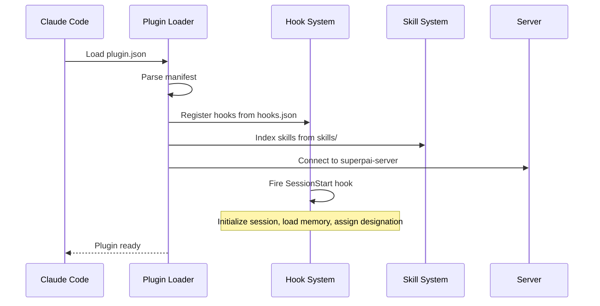

# Plugin Core Architecture

The SuperPAI+ plugin is defined by two core configuration files: `plugin.json` (the manifest) and `hooks.json` (the lifecycle registry). Together, they declare all components and control how the plugin integrates with Claude Code.

---

## plugin.json Structure

The `plugin.json` file is the root manifest that declares all plugin components:

```json
{
  "name": "SuperPAI+",
  "version": "3.7.0",
  "description": "Personal AI Infrastructure for Claude Code",
  "author": "Anshin Technology Solutions",
  "license": "proprietary",
  "entry": "index.ts",
  "components": {
    "skills": "skills/",
    "commands": "commands/",
    "agents": "agents/",
    "hooks": "hooks.json",
    "server": "superpai-server/",
    "mcp": "mcp/"
  },
  "settings": {
    "adaptive_depth": true,
    "tdd_enforcement": true,
    "voice_enabled": true,
    "cost_tracking": true,
    "memory_sync": true
  },
  "profiles": {
    "minimal": { "hooks": ["SessionStart", "PreResponse"] },
    "standard": { "hooks": "all" },
    "full": { "hooks": "all", "extras": true }
  }
}
```

### Key Fields

| Field | Type | Description |
|-------|------|-------------|
| `name` | string | Plugin display name |
| `version` | semver | Current version |
| `components.skills` | path | Directory containing SKILL.md files |
| `components.commands` | path | Directory containing command definitions |
| `components.agents` | path | Directory containing agent definitions |
| `components.hooks` | path | hooks.json registry file |
| `components.server` | path | superpai-server directory |
| `components.mcp` | path | MCP configuration directory |
| `profiles` | object | Hook profiles (minimal, standard, full) |

---

## hooks.json Registry

The `hooks.json` file defines all 13 lifecycle hooks and their configuration:

| Hook | Trigger | Profile | Description |
|------|---------|---------|-------------|
| `SessionStart` | Claude Code startup | All | Initialize session, load memory, assign designation |
| `SessionEnd` | Claude Code shutdown | Standard+ | Save memory, update status, cleanup |
| `PreResponse` | Before every AI response | All | Apply steering rules, check safety gates |
| `PostResponse` | After every AI response | Standard+ | Track cost, update memory, voice output |
| `PreCommand` | Before slash command execution | Standard+ | Validate command, check permissions |
| `PostCommand` | After slash command execution | Standard+ | Log usage, update metrics |
| `PreEdit` | Before file modification | Full | Safety check on file changes |
| `PostEdit` | After file modification | Full | Update file tracking, trigger tests |
| `PreCommit` | Before git commit | Standard+ | Validate commit message, run linting |
| `PostCommit` | After git commit | Standard+ | Update session status, notify sessions |
| `ErrorHandler` | On error | All | Log errors, suggest recovery, voice alert |
| `SafetyGate` | Destructive operation detected | All | Block and require confirmation |
| `ModelSwitch` | AI model change | Standard+ | Log model transition, update cost tracking |

### Hook Profile Gating

| Profile | Active Hooks | Use Case |
|---------|-------------|----------|
| `minimal` | SessionStart, PreResponse, ErrorHandler, SafetyGate | Quick tasks, minimal overhead |
| `standard` | All 13 hooks | Standard development workflow |
| `full` | All 13 hooks + extended analysis | Deep development with full tracking |

Switch profiles with:

```bash
/profile minimal     # Fastest, least overhead
/profile standard    # Balanced (default)
/profile full        # Maximum tracking and analysis
```

---

## Plugin Loading Sequence



### Loading Order

1. Parse `plugin.json` manifest
2. Validate component paths exist
3. Register hooks from `hooks.json`
4. Build skill index from `skills/` directory
5. Register commands from `commands/` directory
6. Load agent definitions from `agents/` directory
7. Connect to superpai-server (if available)
8. Fire `SessionStart` hook
9. Report ready status

---

## Configuration Hierarchy

Settings are resolved in this order (later overrides earlier):

1. **Default values** --- Built into the plugin code
2. **plugin.json settings** --- Plugin-level defaults
3. **Server settings** --- Stored in superpai-server database
4. **Environment variables** --- `SUPERPAI_*` prefixed variables
5. **CLI flags** --- Runtime overrides via command arguments

---

## Error Handling

The plugin uses a fail-safe architecture:

- If superpai-server is unreachable, the plugin operates in offline mode (no persistence)
- If Anna-Voice is unavailable, voice output is silently skipped
- If a hook fails, the error is logged but does not block the response
- If a skill fails to load, it is skipped and a warning is logged

The `ErrorHandler` hook captures all errors and provides structured recovery suggestions.
