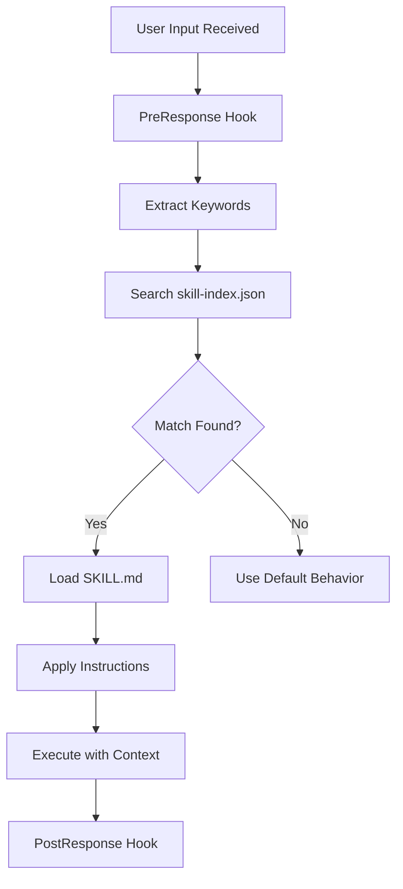

# Skills Architecture

Skills are the primary mechanism for extending SuperPAI+ with specialized capabilities. Each skill is a self-contained module defined by a `SKILL.md` file that provides instructions, triggers, and examples for a specific engineering domain.

---

## SKILL.md Structure

Every skill is defined by a Markdown file with YAML frontmatter:

```markdown
---
name: SecurityAudit
version: 1.2.0
category: Security
triggers: [audit, security, vulnerability, scan, cve]
model_preference: smart
priority: high
---

# SecurityAudit

## Purpose
Run comprehensive security audits against codebases
and infrastructure configurations.

## Pre-requisites
- Access to the project source code
- Understanding of the technology stack in use

## Instructions
1. Scan all source files for common vulnerability patterns
2. Check dependency manifests for known CVEs
3. Review authentication and authorization implementations
4. Examine input validation and output encoding
5. Assess configuration files for insecure defaults
6. Generate a structured audit report

## Output Format
Produce a report with sections for CRITICAL, HIGH,
MEDIUM, and LOW findings, each with file location,
description, and remediation guidance.

## Examples
User: "Run a security audit on the auth module"
Action: Load SecurityAudit skill, scope to auth/ directory,
execute all 7 check categories, produce report.
```

### Frontmatter Fields

| Field | Type | Required | Description |
|-------|------|----------|-------------|
| `name` | string | Yes | Unique skill identifier |
| `version` | semver | No | Skill version |
| `category` | string | Yes | Organizational category |
| `triggers` | string[] | Yes | Keywords that activate this skill |
| `model_preference` | alias | No | Preferred model (simple/smart/genius) |
| `priority` | string | No | Loading priority (low/medium/high) |

---

## Skill Loading Flow



### Loading Priority

When multiple skills match the input, priority determines which loads first:

1. **Explicit invocation** (`/skill SecurityAudit`) --- Always highest priority
2. **High priority skills** --- Load before others
3. **Most specific match** --- Skills with more matching triggers win
4. **First registered** --- Tie-breaker based on registration order

---

## skill-index.json Format

The skill index is an auto-generated file that enables fast skill lookup:

```json
{
  "version": "3.7.0",
  "generated_at": "2026-03-09T00:00:00Z",
  "skills": [
    {
      "name": "TDD",
      "path": "skills/Development/TDD/SKILL.md",
      "category": "Development",
      "triggers": ["test", "tdd", "red-green", "testing"],
      "model_preference": "smart",
      "priority": "high"
    },
    {
      "name": "SecurityAudit",
      "path": "skills/Security/SecurityAudit/SKILL.md",
      "category": "Security",
      "triggers": ["audit", "security", "vulnerability"],
      "model_preference": "smart",
      "priority": "high"
    }
  ]
}
```

### Regenerating the Index

The skill index is regenerated automatically when:
- The plugin starts (SessionStart hook)
- A new skill file is added to the skills directory
- The `/skills rebuild` command is run

---

## Spec-Driven Skill (v3.7.0)

The spec-driven skill is a new skill type introduced in v3.7.0 that creates and maintains specification files:

### How It Works

1. User runs `/spec "feature description"`
2. The spec-driven skill activates
3. A specification document is generated at `.planning/spec-<feature>.md`
4. The specification is decomposed into waves at `.planning/waves-<feature>.md`
5. The user reviews and approves the spec
6. Each wave is executed with TDD and atomic commits

### Spec File Format

```markdown
# Specification: Feature Name

## Requirements
- Requirement 1
- Requirement 2

## Constraints
- Must be backward-compatible
- Must handle 10k concurrent users

## Acceptance Criteria
- [ ] Criterion 1
- [ ] Criterion 2

## Technical Design
Architecture decisions and implementation approach.

## Risks
Known risks and mitigation strategies.
```

---

## Skill Chaining

Skills can invoke other skills during execution. Common chains:

| Primary Skill | Chains To | Reason |
|--------------|-----------|--------|
| SpecDriven | WavePlanner | Decompose spec into waves |
| WavePlanner | TDD | Each wave task uses TDD |
| TDD | AtomicCommit | Each passing test gets committed |
| SecurityAudit | Debugging | Vulnerabilities need investigation |
| CodeReview | Refactor | Review findings may require refactoring |

Chaining is managed by the skill system and respects priority and profile settings.

---

## Best Practices for Custom Skills

1. **Keep skills focused** --- One skill, one capability. Do not create "kitchen sink" skills.
2. **Use specific triggers** --- Avoid generic triggers that overlap with other skills.
3. **Include examples** --- The AI uses examples to understand expected behavior.
4. **Set model preference** --- Indicate which model works best for this skill's tasks.
5. **Test your skill** --- Verify the skill activates correctly and produces expected results.
