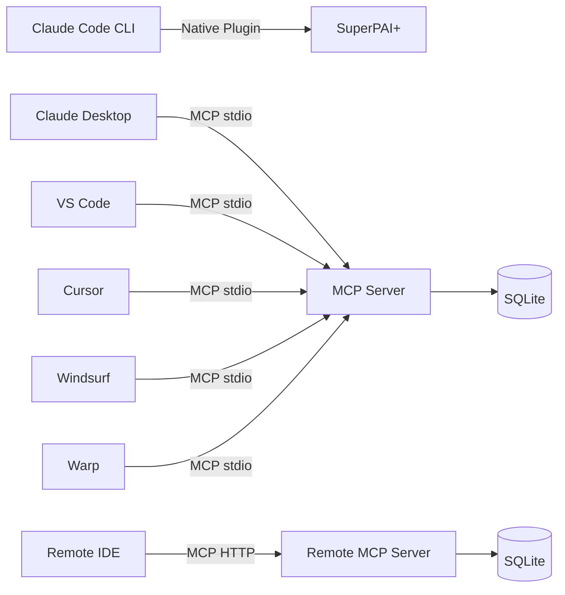

# IDE Integration Overview

SuperPAI+ integrates with multiple IDEs and development environments through the Model Context Protocol (MCP). This enables access to SuperPAI+ tools, prompts, and resources directly within your preferred editor.

---

## MCP Architecture

The Model Context Protocol provides a standardized way for IDEs to communicate with AI tool servers. SuperPAI+ exposes its capabilities through an MCP server that can run locally (stdio transport) or remotely (HTTP transport).

---

## Feature Comparison

| Feature | CLI (Native) | Desktop | VS Code | Cursor | Windsurf | Warp | Remote |
|---------|:---:|:---:|:---:|:---:|:---:|:---:|:---:|
| 73 Skills | Yes | Yes | Yes | Yes | Yes | Yes | Yes |
| 47 Commands | Yes | Yes | Yes | Yes | Yes | Yes | Yes |
| 16 Agents | Yes | Yes | Yes | Yes | Yes | Yes | Yes |
| 13 Hooks | Yes | Partial | Partial | Partial | Partial | Partial | Partial |
| 24 MCP Tools | N/A | Yes | Yes | Yes | Yes | Yes | Yes |
| 133 Prompts | N/A | Yes | Yes | Yes | Partial | No | Yes |
| 8 Resources | N/A | Yes | Yes | Yes | Partial | No | Yes |
| Voice | Yes | Yes | Yes | Yes | Yes | Yes | Yes |
| Multi-Session | Yes | No | No | No | No | No | Yes |
| Memory | Yes | Yes | Yes | Yes | Yes | Yes | Yes |
| Cost Tracking | Yes | Yes | Yes | Yes | Yes | Yes | Yes |

### Notes

- **CLI (Native)** has the fullest feature set because SuperPAI+ was designed for Claude Code CLI
- **Hooks** are partial in MCP mode because some hooks (PreEdit, PostEdit) require file system monitoring that MCP does not provide
- **Multi-Session** is only available in CLI and Remote modes where multiple sessions can coordinate through the server

---

## Prerequisites

| Requirement | Purpose | Notes |
|-------------|---------|-------|
| SuperPAI+ installed | Core platform | See [Installation](/superpai/implementation/installation) |
| superpai-server running | MCP backend | Required for all IDE integrations |
| Bun 1.0+ | Server runtime | Needed to run MCP server |
| IDE with MCP support | Client | Each IDE has its own MCP configuration |

---

## Choosing Your Integration

### Use Claude Code CLI (Native) when:
- You want the fullest feature set
- You prefer terminal-based development
- You need multi-session coordination
- You want native hook support

### Use VS Code / Cursor when:
- You prefer a GUI-based editor
- You want MCP tools alongside your code
- You need file tree navigation and visual diff

### Use Claude Desktop when:
- You want a standalone AI assistant with SuperPAI+ capabilities
- You primarily use MCP tools and prompts
- You do not need file editing integration

### Use Remote Server when:
- Your team shares a single SuperPAI+ installation
- You need cross-machine access
- You want centralized memory and cost tracking

---

## Quick Start

1. Install SuperPAI+ (if not already done)
2. Start the superpai-server: `cd ~/.claude/SuperPAI/superpai-server && bun run start`
3. Configure your IDE's MCP settings (see individual IDE guides)
4. Verify with a health check tool call

See the individual IDE guides for step-by-step configuration:

- [Claude Code CLI](/superpai/ide-integration/claude-code)
- [Claude Desktop](/superpai/ide-integration/claude-desktop)
- [VS Code](/superpai/ide-integration/vscode)
- [Cursor](/superpai/ide-integration/cursor)
- [Windsurf](/superpai/ide-integration/windsurf)
- [Warp Terminal](/superpai/ide-integration/warp)
- [Remote Server](/superpai/ide-integration/remote-server)
