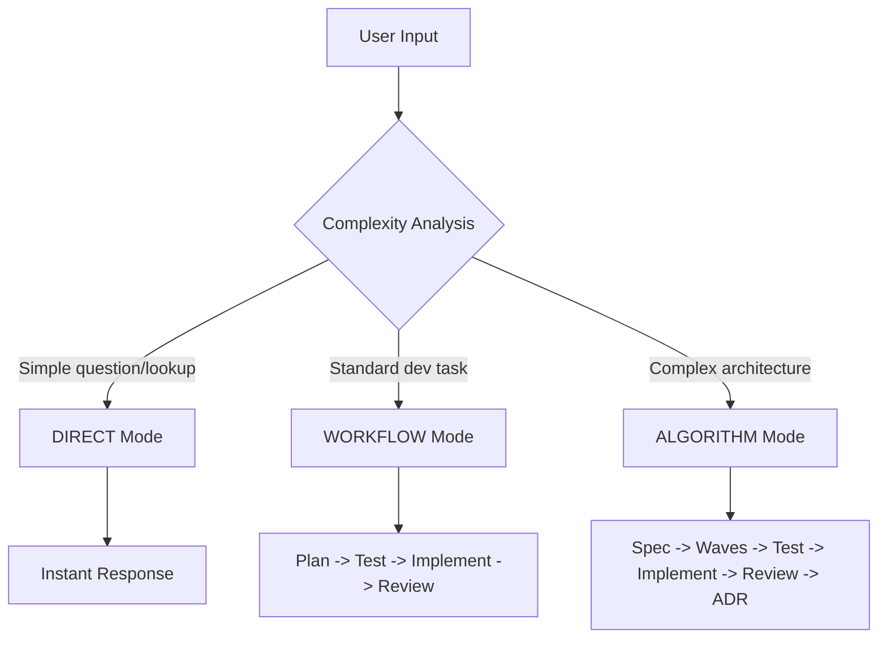

# Adaptive Depth System

The Adaptive Depth System is the brain of SuperPAI+. It automatically selects the right level of effort, planning, and tooling for every task --- from instant answers to multi-day architectural refactors.

---

## Three Operating Modes

| Mode | Trigger | Planning | Testing | Review | Typical Duration |
|------|---------|----------|---------|--------|-----------------|
| **DIRECT** | Simple questions, lookups | None | None | None | Seconds |
| **WORKFLOW** | Standard development tasks | Light planning | TDD required | Self-review | 5-30 minutes |
| **ALGORITHM** | Complex architecture, refactors | Full spec + waves | Comprehensive TDD | Multi-pass review | 30 min - hours |

### DIRECT Mode

Used for questions that need immediate answers without code changes:

- "What does this function do?"
- "How do I configure the database?"
- "Show me the API endpoint for users"

**Behavior:** Responds immediately with no planning, testing, or commit steps.

### WORKFLOW Mode

The standard mode for development tasks. Includes planning, TDD, and review:

- "Add input validation to the signup form"
- "Fix the pagination bug on the dashboard"
- "Write unit tests for the auth middleware"

**Behavior:** Plans the approach, writes tests first (RED phase), implements code (GREEN phase), refactors, then self-reviews before presenting results.

### ALGORITHM Mode

Reserved for complex, multi-step tasks requiring deep analysis:

- "Re-architect the notification system for real-time delivery"
- "Implement a multi-tenant RBAC system"
- "Optimize database queries across the entire application"

**Behavior:** Generates a full specification, decomposes into waves, executes each wave with comprehensive testing, performs multi-pass review, and produces architectural decision records.

---

## Mode Selection Flow



The mode selection happens automatically based on:

1. **Task keywords** --- Words like "refactor", "re-architect", "optimize across" trigger ALGORITHM mode
2. **File scope** --- Tasks touching 5+ files escalate to WORKFLOW; 15+ files to ALGORITHM
3. **Dependency depth** --- Tasks requiring changes in multiple system layers escalate
4. **User override** --- You can force a mode with `/mode direct`, `/mode workflow`, or `/mode algorithm`

---

## CCR Model Router

The Cost-Conscious Router (CCR) selects the optimal AI model for each sub-task within a mode:

| Sub-task | Model Selection | Alias |
|----------|----------------|-------|
| Quick formatting, simple edits | Claude Haiku | `simple` |
| Standard coding, review, testing | Claude Sonnet | `smart` |
| Architecture, complex debugging | Claude Opus | `genius` |

The CCR minimizes cost by routing simple sub-tasks to cheaper models while reserving expensive models for tasks that genuinely require deeper reasoning.

---

## Model Aliases

v3.7.0 introduced human-friendly model aliases:

| Alias | Model | Cost Tier | Best For |
|-------|-------|-----------|----------|
| `simple` | Claude 3.5 Haiku | Low | Formatting, lookups, simple edits |
| `smart` | Claude 3.5 Sonnet | Medium | Standard development, code review |
| `genius` | Claude Opus | High | Architecture, complex refactoring |

Use aliases in commands:

```bash
/cost model=genius      # Check Opus usage
/mode workflow smart    # Force WORKFLOW with Sonnet
```

Or in steering rules:

```
rule.model_preference: smart
rule.escalation_model: genius
```

---

## Tuning Adaptive Depth

### Hook Profile Interaction

The hook profile affects how Adaptive Depth behaves:

| Profile | DIRECT Behavior | WORKFLOW Behavior | ALGORITHM Behavior |
|---------|----------------|-------------------|-------------------|
| `minimal` | No hooks fire | Basic hooks only | Core hooks only |
| `standard` | Standard hooks | All hooks fire | All hooks fire |
| `full` | All hooks | All hooks + extras | All hooks + deep analysis |

### Manual Override

Force a specific mode for the current task:

```bash
/mode direct       # Quick answer, no ceremony
/mode workflow     # Standard dev flow
/mode algorithm    # Full spec-driven approach
```

### Persistent Configuration

Set default behavior in your SuperPAI+ configuration:

```json
{
  "adaptive_depth": {
    "default_mode": "workflow",
    "escalation_threshold": 10,
    "model_preference": "smart"
  }
}
```

---

## Best Practices

1. **Trust the system** --- Adaptive Depth is usually right about mode selection. Override only when you have a specific reason.
2. **Use `/quick` for small tasks** --- It bypasses mode selection entirely and just gets the job done.
3. **Use `/spec` for big features** --- It forces ALGORITHM mode with full specification and wave planning.
4. **Watch the cost** --- Use `/cost` to monitor which models are being used and how much they cost.
