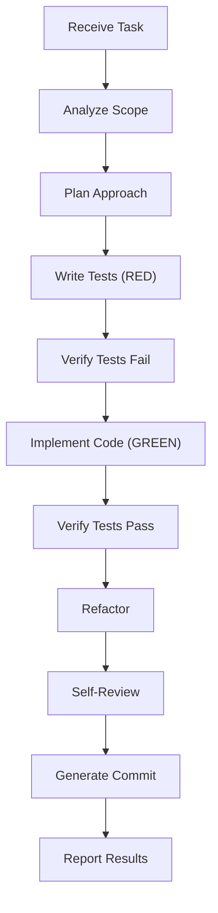

# Development Workflow

SuperPAI+ enforces a structured development workflow that ensures quality, consistency, and traceability. This guide covers the standard WORKFLOW mode flow, TDD enforcement, git worktrees, and code review processes.

---

## Standard WORKFLOW Mode Flow

When SuperPAI+ operates in WORKFLOW mode (the default for most development tasks), it follows this sequence:



### Phase Details

1. **Analyze Scope** --- Determine which files, modules, and systems are affected
2. **Plan Approach** --- Outline the implementation strategy (visible to user)
3. **Write Tests (RED)** --- Create test cases that define expected behavior
4. **Verify Tests Fail** --- Confirm tests fail before implementation exists
5. **Implement Code (GREEN)** --- Write the minimum code to make tests pass
6. **Verify Tests Pass** --- Run tests to confirm implementation is correct
7. **Refactor** --- Improve code quality while keeping tests green
8. **Self-Review** --- Check for edge cases, security issues, and code standards
9. **Generate Commit** --- Create an atomic conventional commit
10. **Report Results** --- Present summary of changes, tests, and any concerns

---

## The TDD Iron Law

SuperPAI+ enforces a strict TDD discipline:

> **No implementation code may be written before a failing test exists for it.**

This is not a suggestion --- it is enforced by the plugin's constitutional steering rules. If you ask SuperPAI+ to write code without tests, it will:

1. Write the tests first
2. Show you the failing tests
3. Only then proceed to implementation

### TDD Exceptions

The only exceptions to TDD enforcement are:

- Configuration file changes (no testable behavior)
- Documentation-only changes
- Asset updates (images, static files)
- Environment setup scripts

---

## Git Worktrees

SuperPAI+ supports git worktrees for isolated development. Worktrees allow you to work on multiple branches simultaneously without stashing or switching.

### Creating a Worktree

```bash
/worktree create feat/auth-redesign
```

This creates a new worktree in `.claude/worktrees/feat-auth-redesign/` with a clean working directory on the specified branch.

### Worktree Workflow

1. Create a worktree for your feature branch
2. SuperPAI+ switches its working directory to the worktree
3. All file operations happen in the isolated worktree
4. When done, merge the branch and clean up the worktree

### Worktree Best Practices

- Use worktrees for features that might conflict with current work
- Each Claude Code session can have its own worktree
- Clean up worktrees after merging to avoid disk space bloat

---

## Code Review

SuperPAI+ performs automated code review at configurable strictness levels.

### Review Command

```bash
/review                  # Review staged changes
/review --strict         # Strict mode: no warnings tolerated
/review --file auth.ts   # Review a specific file
/review --diff HEAD~3    # Review last 3 commits
```

### Review Categories

| Category | Checks |
|----------|--------|
| **Correctness** | Logic errors, edge cases, null handling |
| **Security** | Input validation, SQL injection, XSS, auth bypasses |
| **Performance** | N+1 queries, unnecessary re-renders, memory leaks |
| **Style** | Naming conventions, file organization, import order |
| **Testing** | Coverage gaps, missing edge cases, brittle tests |
| **Documentation** | Missing JSDoc, outdated comments, unclear naming |

### Review Output

The review produces a structured report:

```
## Code Review Summary

### Critical Issues (0)
None found.

### Warnings (2)
1. auth.ts:45 - Missing null check on user.email
2. auth.ts:78 - Password comparison should use timing-safe equals

### Suggestions (3)
1. Consider extracting validation logic to a separate function
2. Token expiry could be configurable via environment variable
3. Add rate limiting to prevent brute-force attacks

### Test Coverage
- Lines: 87%
- Branches: 72%
- Functions: 91%
```

---

## The /quick Workflow

For small tasks, the `/quick` command bypasses the full WORKFLOW ceremony:

```bash
/quick "add input validation for email field on signup form"
```

This still follows TDD when applicable but skips the planning and review phases for faster execution. See the [GSD Integration](/superpai/user-guide/gsd-integration) guide for details.

---

## Best Practices

1. **Trust the workflow** --- The phases exist for a reason. Skipping tests leads to bugs; skipping review leads to tech debt.
2. **Use `/quick` for small tasks** --- Do not force full WORKFLOW mode on trivial changes.
3. **Review before committing** --- Even with automatic review, take a moment to verify changes look correct.
4. **Use worktrees for risky changes** --- Isolate experimental or risky work in a worktree.
5. **Read the commit messages** --- SuperPAI+ generates descriptive commit messages. Verify they accurately describe the changes.
