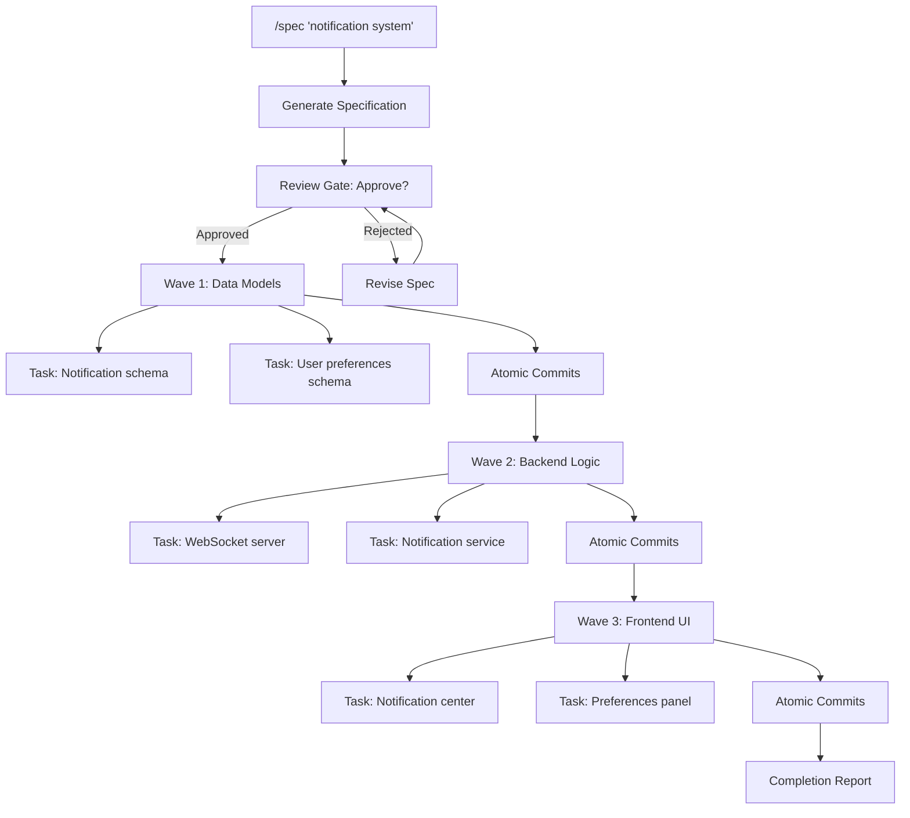

# GSD Integration (v3.7.0)

The GSD (Get Stuff Done) framework is the marquee feature of SuperPAI+ v3.7.0. It introduces spec-driven development, wave-based planning, model aliases, and atomic commits to create a streamlined, high-throughput development workflow.

---

## The /quick Command

`/quick` is designed for small, well-defined tasks that can be completed in a single pass without multi-step planning.

### Usage

```bash
/quick "add a GET /health endpoint that returns { status: 'ok', uptime: process.uptime() }"
```

### What Happens

1. SuperPAI+ analyzes the task to confirm it is small enough for single-pass execution
2. If TDD is applicable, a test is written and verified to fail (RED)
3. The implementation is written (GREEN)
4. A quick refactor pass is applied if needed
5. An atomic conventional commit is generated automatically

### When to Use /quick

- Adding a single endpoint, component, or utility function
- Fixing a well-understood bug
- Writing a specific test case
- Updating configuration or documentation
- Small refactors scoped to a single file

### When NOT to Use /quick

- Tasks that touch multiple systems or layers
- Features requiring architectural decisions
- Work that needs stakeholder review before implementation
- Anything you would describe as "it depends"

---

## The /spec Command

`/spec` is for complex features that require planning, decomposition, and multi-step execution.

### Usage

```bash
/spec "implement a real-time notification system with WebSocket delivery,
       notification preferences per user, and a notification center UI"
```

### What Happens

1. **Specification Generation** --- SuperPAI+ generates a comprehensive spec document saved to `.planning/spec-<feature>.md`
2. **Wave Decomposition** --- The feature is broken into ordered waves, each containing independent tasks
3. **Review Gate** --- The spec and wave plan are presented for your approval before execution begins
4. **Wave Execution** --- Each wave is executed sequentially with TDD and atomic commits
5. **Completion Report** --- A summary of all changes, tests, and commits is generated

### Wave Planning Diagram



### Specification Files

The `/spec` command creates persistent files in your project's `.planning/` directory:

| File | Purpose |
|------|---------|
| `.planning/spec-<feature>.md` | Full specification with requirements and constraints |
| `.planning/waves-<feature>.md` | Wave breakdown with task list and status |
| `.planning/decisions-<feature>.md` | Architectural Decision Records (ADRs) |

These files persist across sessions, enabling multi-day feature development with full context preservation.

---

## Atomic Commits

Every completed task in a `/quick` or `/spec` workflow generates an automatic conventional commit.

### Commit Format

```
<prefix>(<scope>): <description>

<body>

Co-Authored-By: SuperPAI+ <superpai@anshintech.net>
```

### Prefix Selection

| Prefix | When Used |
|--------|-----------|
| `feat` | New feature or capability |
| `fix` | Bug fix |
| `refactor` | Code restructuring without behavior change |
| `test` | Adding or modifying tests |
| `docs` | Documentation changes |
| `chore` | Maintenance, dependencies, configuration |

### Example

```bash
/quick "fix the off-by-one error in pagination"
```

Produces:

```
fix(pagination): correct off-by-one error in page calculation

- Changed page offset from (page * limit) to ((page - 1) * limit)
- Added boundary check for page < 1
- Updated existing pagination tests

Co-Authored-By: SuperPAI+ <superpai@anshintech.net>
```

---

## Model Aliases

GSD introduces three model aliases for intuitive model selection:

| Alias | Model | Cost | Best For |
|-------|-------|------|----------|
| `simple` | Claude 3.5 Haiku | $0.25/$1.25 per 1M tokens | Quick lookups, formatting |
| `smart` | Claude 3.5 Sonnet | $3/$15 per 1M tokens | Standard development |
| `genius` | Claude Opus | $15/$75 per 1M tokens | Architecture, complex analysis |

The GSD framework automatically routes tasks to the appropriate model. `/quick` tasks default to `smart`, while `/spec` planning phases use `genius` and individual wave tasks use `smart`.

---

## Best Practices

1. **Start with `/quick`** --- Most tasks are smaller than you think. Try `/quick` first and escalate to `/spec` only if needed.
2. **Review specs carefully** --- The review gate exists for a reason. Read the spec before approving wave execution.
3. **Trust atomic commits** --- Each commit is self-contained and tested. You can revert individual tasks without affecting others.
4. **Use `.planning/` files** --- Reference spec files in conversations to maintain context across sessions.
