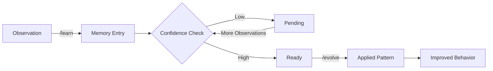

# Memory & Learning System

SuperPAI+ includes a persistent memory system that captures patterns, decisions, and context across sessions. The memory system enables the AI to learn from past interactions and continuously improve its effectiveness.

---

## Memory Tiers

| Tier | Scope | Persistence | Storage | Use Case |
|------|-------|-------------|---------|----------|
| **Session** | Current session only | Until session ends | In-memory | Active task context, recent decisions |
| **Project** | Current project | Across sessions | SQLite (server) | Project conventions, architecture decisions |
| **Global** | All projects | Permanent | SQLite (server) | Engineering patterns, user preferences |

### Session Memory

Automatically captured during development:
- Files read and modified
- Decisions made and reasoning
- Test results and coverage
- Errors encountered and resolutions
- Agent interactions and handoffs

### Project Memory

Persists across sessions for the same project:
- Architecture decisions and ADRs
- Coding conventions discovered
- Common patterns in the codebase
- Dependencies and their quirks
- Deployment procedures and gotchas

### Global Memory

Persists across all projects:
- User's preferred coding style
- Common tool configurations
- Frequently used patterns
- Learning pipeline outputs

---

## Learning Pipeline

The learning pipeline transforms observations into persistent knowledge through two commands:

### /learn --- Capture Knowledge

```bash
/learn "This project uses barrel exports in every directory"
/learn "The team prefers async/await over .then() chains"
/learn "Database migrations must be backward-compatible for zero-downtime deploys"
```

Each `/learn` call creates a memory entry with:
- The learning text
- Source context (file, task, session)
- Confidence level (increases with repeated observations)
- Category (auto-classified: pattern, convention, gotcha, preference)

### /evolve --- Apply Learnings

```bash
/evolve             # Apply all high-confidence learnings to current behavior
/evolve review      # Review pending learnings before applying
/evolve rollback    # Undo the last evolution
```

The `/evolve` command analyzes accumulated learnings and updates the AI's behavioral patterns. This is a deliberate, user-controlled process --- SuperPAI+ never auto-evolves.

### Pipeline Flow



---

## Spec Files (.planning/)

Introduced in v3.7.0, spec files provide structured, persistent context for feature development:

| File | Purpose | Created By |
|------|---------|------------|
| `.planning/spec-<feature>.md` | Full specification with requirements | `/spec` command |
| `.planning/waves-<feature>.md` | Wave breakdown with task status | `/spec` command |
| `.planning/decisions-<feature>.md` | Architectural Decision Records | During implementation |

Spec files are automatically loaded into memory when a session starts in a directory containing a `.planning/` folder. This enables multi-session, multi-day feature development with full context.

---

## Memory Commands

| Command | Description |
|---------|-------------|
| `/memory` | View current memory state |
| `/memory show` | Display all memory entries |
| `/memory search <term>` | Search memory entries |
| `/memory tier project` | Show only project-tier memories |
| `/learn "<text>"` | Capture a new learning |
| `/evolve` | Apply high-confidence learnings |
| `/evolve review` | Review before applying |
| `/forget id:<id>` | Remove a specific memory entry |

---

## Memory Sync

In multi-session environments, memory is synchronized through the superpai-server:

1. Each session pushes new memory entries to the server
2. The server deduplicates and merges entries
3. Other sessions pull updates during `/sync` or at startup

Sync latency in v3.7.0 is under 1 second (improved from 5 seconds in v3.6.x).

---

## Best Practices

1. **Use `/learn` for project conventions** --- Help SuperPAI+ understand your team's patterns
2. **Review before `/evolve`** --- Always use `/evolve review` to verify learnings are correct
3. **Clean up periodically** --- Remove outdated learnings with `/forget`
4. **Trust the tiers** --- Session memory handles active context; project memory handles conventions; global memory handles preferences
5. **Use spec files for big features** --- The `.planning/` directory is the best way to maintain context across sessions
