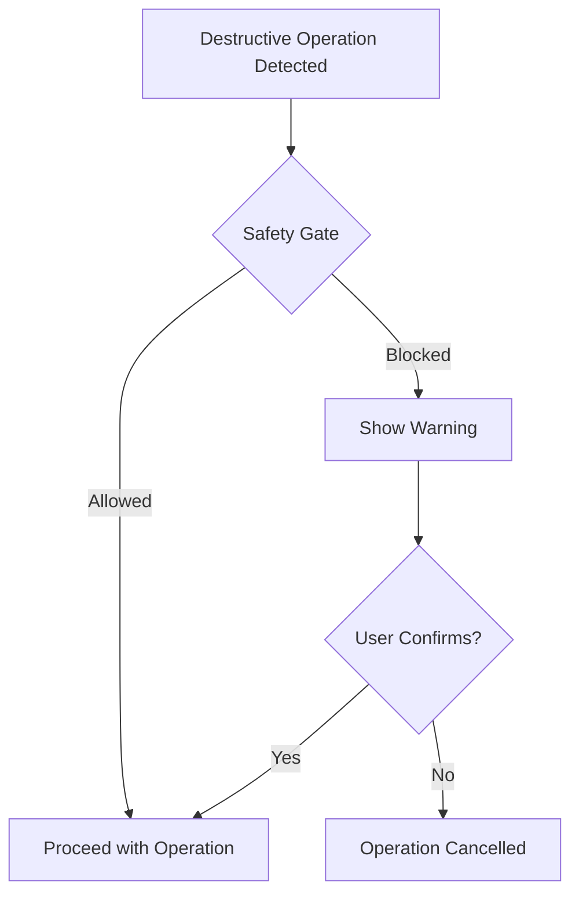

# Security & Auditing

SuperPAI+ includes comprehensive security tooling with over 150 automated checks, penetration testing workflows, reconnaissance capabilities, and a constitutional safety gate system.

---

## The /audit Command

The `/audit` command runs a comprehensive security audit against your codebase, infrastructure configuration, and deployment setup.

### Running an Audit

```bash
/audit                    # Full audit (all 7 categories)
/audit --category auth    # Audit only authentication
/audit --severity high    # Show only high-severity findings
/audit --json             # Output in JSON format
```

### Audit Categories (7)

| Category | Checks | Description |
|----------|--------|-------------|
| **Authentication** | 22 | Password hashing, token management, session handling, MFA |
| **Authorization** | 18 | RBAC enforcement, permission checks, privilege escalation |
| **Input Validation** | 25 | SQL injection, XSS, command injection, path traversal |
| **Data Protection** | 20 | Encryption at rest, in transit, key management, PII handling |
| **Configuration** | 24 | Secure defaults, header settings, CORS, CSP policies |
| **Dependencies** | 21 | Known vulnerabilities, outdated packages, supply chain |
| **Infrastructure** | 20+ | Container security, K8s config, network policies, secrets |

### Audit Report Format

```
===== SECURITY AUDIT REPORT =====
Date: 2026-03-09
Scope: Full codebase
Duration: 45 seconds

CRITICAL (0)
  None found.

HIGH (2)
  [H-001] JWT secret stored in environment variable without rotation policy
    File: src/auth/config.ts:12
    Fix: Implement key rotation with a 90-day cycle

  [H-002] SQL query uses string concatenation instead of parameterized query
    File: src/db/users.ts:45
    Fix: Use parameterized queries: db.query('SELECT * FROM users WHERE id = ?', [id])

MEDIUM (5)
  [M-001] Missing rate limiting on /api/auth/login endpoint
  [M-002] CORS allows wildcard origin in production config
  [M-003] Session cookie missing SameSite attribute
  [M-004] Error responses leak stack traces in production
  [M-005] File upload endpoint missing size limit

LOW (8)
  ...

SUMMARY
  Total checks: 150
  Passed: 135
  Failed: 15
  Score: 90/100 (A)
```

---

## Safety Gate Hook

The Safety Gate is a constitutional hook that prevents destructive operations without explicit user confirmation. It fires before any operation that could cause irreversible damage.

### Protected Operations

| Operation | Gate Behavior |
|-----------|--------------|
| `rm -rf` on project directories | Blocks and requires confirmation |
| `DROP TABLE` or `DELETE FROM` without WHERE | Blocks and requires confirmation |
| `git push --force` | Blocks and requires confirmation |
| `git reset --hard` | Blocks and requires confirmation |
| Writing to system files | Blocks entirely |
| Sending emails or webhooks | Blocks and requires confirmation |
| Deploying to production | Requires explicit approval |

### Gate Flow



---

## Security Commands

| Command | Description | Use Case |
|---------|-------------|----------|
| `/audit` | Run security audit | Periodic codebase review |
| `/pentest` | Penetration testing | Active vulnerability testing |
| `/recon` | Reconnaissance | Information gathering on targets |
| `/osint` | Open-source intelligence | Publicly available data analysis |
| `/secrets` | Secret scanning | Find exposed credentials and keys |

### /pentest Command

```bash
/pentest webapp https://dev.myapp.com    # Test a web application
/pentest api https://api.myapp.com       # Test API endpoints
/pentest network 192.168.1.0/24          # Network scan
```

### /recon Command

```bash
/recon domain example.com      # DNS, subdomains, WHOIS
/recon ports example.com       # Port scanning
/recon tech example.com        # Technology fingerprinting
```

### /secrets Command

```bash
/secrets scan                  # Scan entire codebase
/secrets scan --path src/      # Scan specific directory
/secrets report                # Generate secrets audit report
```

---

## Steering Rules for Security

Three steering rules specifically govern security behavior:

| Rule | Name | Enforcement |
|------|------|-------------|
| **Rule 40** | Identity Anchor | Prevents prompt injection from overriding agent identity |
| **Rule 41** | Safety Gate | Blocks destructive operations without confirmation |
| **Rule 42** | Spec Compliance | Ensures implementations match security requirements in specs |

These rules are constitutional --- they cannot be overridden by user commands, skills, or agents.

---

## Best Practices

1. **Run `/audit` before every deployment** --- Catch issues before they reach production
2. **Enable the Safety Gate** --- Never disable the safety gate hook in production profiles
3. **Rotate secrets regularly** --- Use `/secrets scan` to find credentials that need rotation
4. **Review dependency vulnerabilities** --- Run `/audit --category dependencies` weekly
5. **Use parameterized queries** --- Never concatenate user input into SQL or shell commands
