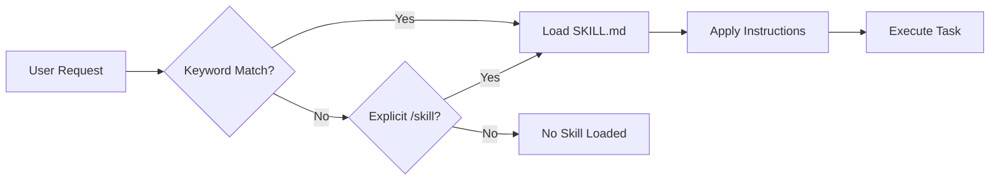

# Skills System (73 Skills)

Skills are the foundational building blocks of SuperPAI+. Each skill is a self-contained capability defined by a `SKILL.md` file that teaches the AI how to perform a specific engineering task with expertise and consistency.

---

## How Skills Work

A skill is loaded when its trigger conditions are met --- either by matching keywords in the user's request, being explicitly invoked via `/skill <name>`, or being activated by a hook or agent.

### Skill Structure

Each skill lives in a directory under `~/.claude/skills/` and contains:

```
skills/
  MySkill/
    SKILL.md          # Skill definition and instructions
    skill-index.json  # Metadata for discovery and matching
    templates/        # Optional: file templates
    examples/         # Optional: usage examples
```

### Loading Flow



---

## Skill Categories

| Category | Count | Description |
|----------|-------|-------------|
| Development | 18 | Core coding, testing, debugging, review |
| Architecture | 8 | System design, patterns, refactoring |
| Security | 7 | Auditing, penetration testing, secrets |
| DevOps | 9 | Deployment, CI/CD, infrastructure |
| Database | 6 | Schema, migrations, optimization |
| Documentation | 5 | Docs generation, API docs, diagrams |
| Voice | 4 | TTS/STT integration, voice commands |
| Memory | 3 | Learning, knowledge management |
| GSD | 4 | Spec-driven development (v3.7.0) |
| Coordination | 3 | Multi-session, inbox, sync |
| Utility | 6 | Formatting, conversion, helpers |

---

## Key Skills Reference

| Skill | Category | Trigger Keywords | Description |
|-------|----------|-----------------|-------------|
| `TDD` | Development | test, tdd, red-green | Test-driven development workflow |
| `CodeReview` | Development | review, check, audit code | Structured code review process |
| `Debugging` | Development | debug, fix, issue, error | Systematic debugging methodology |
| `Refactor` | Architecture | refactor, clean, improve | Safe code refactoring with tests |
| `APIDesign` | Architecture | api, endpoint, rest | RESTful API design patterns |
| `SecurityAudit` | Security | audit, security, vulnerability | 150+ automated security checks |
| `PenTest` | Security | pentest, penetration, exploit | Penetration testing workflows |
| `K8sDeploy` | DevOps | deploy, kubernetes, k8s | Kubernetes deployment management |
| `DockerBuild` | DevOps | docker, container, image | Dockerfile and compose creation |
| `CICDPipeline` | DevOps | pipeline, ci, cd, gitlab | CI/CD pipeline configuration |
| `DBMigration` | Database | migrate, schema, alter | Database migration management |
| `QueryOptimize` | Database | optimize, slow query, index | SQL query performance tuning |
| `APIDoc` | Documentation | document, api doc, swagger | API documentation generation |
| `MermaidDiagram` | Documentation | diagram, flowchart, mermaid | Architecture diagram creation |
| `VoiceIntegration` | Voice | voice, speak, tts | Anna-Voice configuration |
| `SpecDriven` | GSD | spec, specification, plan | Spec file generation (v3.7.0) |
| `WavePlanner` | GSD | wave, decompose, phases | Wave-based task decomposition |
| `AtomicCommit` | GSD | commit, atomic, conventional | Conventional commit generation |
| `ModelRouter` | GSD | model, alias, simple/smart | Model alias routing |
| `SessionCoord` | Coordination | session, coordinate, inbox | Multi-session coordination |
| `MemoryCapture` | Memory | learn, remember, memory | Knowledge capture and storage |
| `PatternEvolve` | Memory | evolve, pattern, improve | Apply learned patterns |

---

## Using Skills

### Automatic Activation

Most skills activate automatically when keywords match. For example, saying "write tests for the user service" triggers the `TDD` skill.

### Explicit Invocation

```bash
/skill TDD           # Load the TDD skill explicitly
/skill SecurityAudit  # Load the security audit skill
/skills              # List all available skills
/skill info TDD      # Show details about a specific skill
```

### Skill Chaining

Skills can chain together. For example, the `SpecDriven` skill may invoke `WavePlanner`, which invokes `TDD` for each task, which invokes `AtomicCommit` after each completion. This chaining is automatic and managed by the skill system.

---

## Creating Custom Skills

You can create your own skills by adding a `SKILL.md` file and `skill-index.json` to the skills directory. See the [Custom Components](/superpai/implementation/custom-components) guide for the complete template and registration process.

### Minimal Skill Template

```markdown
---
name: MyCustomSkill
triggers: [keyword1, keyword2]
category: Development
---

# MyCustomSkill

## Purpose
What this skill does.

## Instructions
Step-by-step instructions for the AI to follow.

## Examples
Example usage and expected outcomes.
```
