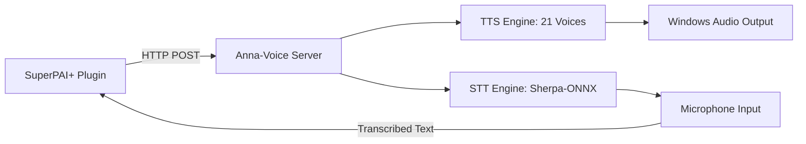

# Voice Integration (Anna-Voice)

SuperPAI+ integrates with Anna-Voice to provide spoken output, voice input, and agent-specific voice personas. This creates a natural, multimodal development experience where agents speak their progress, ask questions aloud, and respond to voice commands.

---

## Architecture



### Connection Points

| Component | URL | Protocol |
|-----------|-----|----------|
| Anna-Voice (local) | `http://localhost:8888` | HTTP REST |
| Anna-Voice (WSL proxy) | `http://localhost:8888` | HTTP REST (via Windows host) |
| Anna-Voice (remote) | `https://voice.anshintech.net` | HTTPS REST |

### Independence Principle

Anna-Voice and SuperPAI+ are **independent systems**. Neither requires the other to function:

- SuperPAI+ works without Anna-Voice (silent mode)
- Anna-Voice works without SuperPAI+ (standalone TTS/STT app)
- When both are available, they integrate automatically

---

## MCP Tools for Voice

SuperPAI+ exposes three MCP tools for voice interaction:

| Tool | Purpose | Parameters |
|------|---------|------------|
| `anna_speak` | Send text to be spoken aloud | `message`, `voice_id`, `title` |
| `anna_listen` | Activate microphone for voice input | `duration`, `language` |
| `anna_dispatch` | Route a message to the appropriate agent voice | `agent`, `message` |

### anna_speak Example

```bash
curl -X POST http://localhost:8888/notify \
  -H "Content-Type: application/json" \
  -d '{
    "message": "Tests are passing, moving to refactor phase",
    "voice_id": "marcus_webb",
    "title": "Engineer Agent"
  }'
```

### anna_dispatch Example

The dispatch tool automatically selects the voice based on the agent:

```json
{
  "agent": "Marcus",
  "message": "The architecture review is complete. Three concerns identified."
}
```

---

## Agent Voice Assignments

Each of the 16 agents has a default voice assignment:

| Agent | Voice Name | Gender | Accent | Characteristics |
|-------|-----------|--------|--------|-----------------|
| Marcus | Marcus Webb | Male | American | Deep, measured, deliberate |
| Kira | Kira Chen | Female | American | Warm, energetic, clear |
| Dev | Dev Patel | Male | British-Indian | Calm, precise, technical |
| Quinn | Quinn Murphy | Male | Irish | Direct, efficient, no-nonsense |
| Sage | Sage Williams | Female | British | Thoughtful, slow, considered |
| Sentry | Sentry Blake | Male | American | Alert, sharp, commanding |
| Doc | Doc Reeves | Male | American | Clear, patient, educational |
| Tester | Tester Kim | Female | Korean-American | Methodical, thorough, detailed |
| Data | Data Singh | Male | Indian | Analytical, precise, data-driven |
| Scout | Scout Adams | Female | American | Quiet, focused, observant |
| Voice | Voice System | Neutral | American | Adaptive, clear, system-like |
| Coach | Coach Torres | Female | American | Supportive, direct, encouraging |
| Planner | Planner Liu | Male | Chinese-American | Organized, structured, systematic |
| Debugger | Debugger Okafor | Male | Nigerian | Patient, systematic, thorough |
| Designer | Designer Novak | Female | European | Creative, empathetic, visual |
| Ops | Ops Kowalski | Male | American | Calm under pressure, steady |

---

## Fire-and-Forget Rule

Voice notifications follow a strict **fire-and-forget** pattern:

1. SuperPAI+ sends the HTTP request to Anna-Voice
2. SuperPAI+ does **not** wait for a response
3. If Anna-Voice is unavailable, the request silently fails
4. Voice output never blocks or delays the development workflow

This ensures that voice is always additive --- it enhances the experience but never degrades performance.

---

## Configuration

### Enable/Disable Voice

```bash
/voice on        # Enable voice output
/voice off       # Disable voice output
/voice status    # Check voice connection status
```

### Change Default Voice

In your SuperPAI+ configuration:

```json
{
  "voice": {
    "enabled": true,
    "url": "http://localhost:8888",
    "default_voice": "marcus_webb",
    "speak_on_completion": true,
    "speak_on_error": true
  }
}
```

### Per-Agent Voice Override

You can override the default voice for any agent in the agent definition file. See the [Custom Components](/superpai/implementation/custom-components) guide.

---

## Troubleshooting

| Issue | Solution |
|-------|----------|
| No voice output | Check if Anna-Voice is running: `curl http://localhost:8888/health` |
| Voice delayed | Ensure fire-and-forget is enabled (default); check network latency |
| Wrong voice | Verify agent voice assignment in configuration |
| WSL cannot reach voice | Ensure Windows host IP is accessible from WSL; use `host.docker.internal` or `$(hostname).local` |
