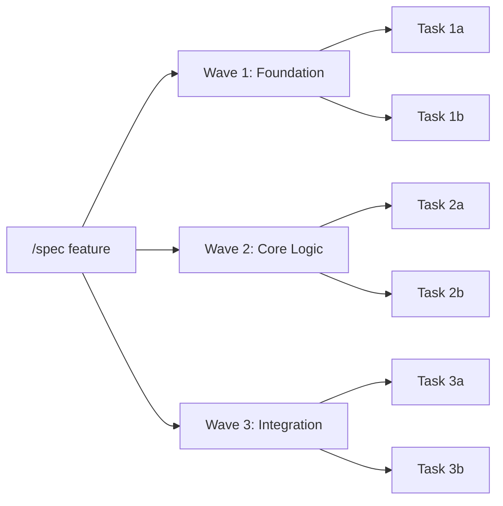

# What's New in SuperPAI+ v3.7.0

**Release Date:** March 2026 | **Codename:** GSD (Get Stuff Done)

SuperPAI+ v3.7.0 is the largest feature release since the platform's inception. The GSD framework introduces spec-driven development, wave-based planning, model aliases, and atomic commits --- transforming how engineers interact with AI-assisted development.

---

## Headline Features

### GSD Framework Integration

The GSD (Get Stuff Done) framework adds two powerful new commands that shift SuperPAI+ from reactive assistance to proactive, spec-driven engineering:

- **`/quick <task>`** --- Execute small, well-defined tasks in a single pass. No planning phase, no multi-step workflow. Just describe what you need and SuperPAI+ delivers it with an atomic commit.
- **`/spec <feature>`** --- Generate a comprehensive specification document, break work into shipping waves, and execute each wave with full test coverage and atomic commits.

### Wave-Based Planning

Complex features are now decomposed into **waves** --- ordered groups of tasks that can be planned, reviewed, and shipped independently. Each wave produces:

- A Mermaid diagram showing the dependency graph
- A checklist of deliverables
- Automatic atomic commits per completed task
- A summary report after all waves complete



### Model Aliases

Instead of memorizing model IDs, v3.7.0 introduces three intuitive aliases:

| Alias | Maps To | Best For |
|-------|---------|----------|
| `simple` | Claude Haiku | Quick lookups, formatting, simple edits |
| `smart` | Claude Sonnet | Standard development, code review, testing |
| `genius` | Claude Opus | Architecture decisions, complex debugging, refactoring |

Use them anywhere a model is referenced: `/cost model=genius`, steering rules, hook profiles.

### Atomic Commits

Every completed task in a `/quick` or `/spec` workflow now generates an automatic conventional commit:

```
feat(auth): add JWT token validation middleware

- Validates token expiry and signature
- Returns 401 for invalid/expired tokens
- Adds rate limiting per API key

Co-Authored-By: SuperPAI+ <superpai@anshintech.net>
```

The commit message is generated from the task description and includes the appropriate conventional-commit prefix (`feat`, `fix`, `refactor`, `docs`, `test`, `chore`).

### Spec-Driven Skill

A new built-in skill creates and maintains specification files in the `.planning/` directory:

- **`.planning/spec-<feature>.md`** --- The full specification with requirements, constraints, and acceptance criteria
- **`.planning/waves-<feature>.md`** --- The wave breakdown with task assignments and status tracking
- **`.planning/decisions-<feature>.md`** --- Architectural Decision Records (ADRs) made during implementation

These files persist across sessions, enabling multi-session feature development with full context.

---

## New Steering Rules (40-42)

Three new governance rules were added to the constitutional framework:

| Rule | Name | Purpose |
|------|------|---------|
| 40 | Identity Anchor | Prevents prompt injection from overriding agent identity |
| 41 | Safety Gate | Blocks destructive operations without explicit confirmation |
| 42 | Spec Compliance | Ensures implementations match their specification documents |

---

## Additional Improvements

- **Hook profile tuning** --- Fine-grained control over which hooks fire in which profiles (minimal, standard, full)
- **Cost tracking improvements** --- Real-time token usage displayed per-model with cumulative session totals
- **Memory sync optimization** --- Reduced sync latency from 5s to under 1s for multi-session coordination
- **MCP transport upgrade** --- HTTP Streamable transport now supported alongside stdio for remote deployments

---

## Upgrade Path

Upgrading from v3.6.x is non-breaking:

```bash
cd ~/.claude/SuperPAI
git pull origin main
cd superpai-server && bun install && bun run db:migrate
```

Restart Claude Code and verify with `/version`. See the [Upgrade Guide](/superpai/implementation/upgrade) for detailed instructions.

---

## Breaking Changes

**None.** v3.7.0 is fully backward-compatible with v3.6.x configurations, skills, commands, and agents. The GSD framework is purely additive.
